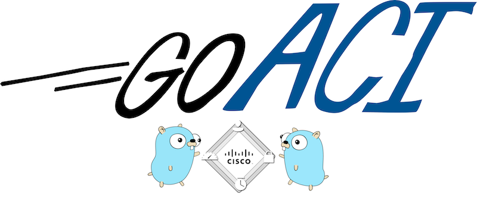

<p align="center">

<br/>
ACI client library for Go
<p>
<hr/>

GoACI is a Go client library for Cisco ACI. It features a simple, extensible API, [advanced JSON manipulation](#result-manipulation), and a [backup
client](#backup-client) for running queries against the backup file.

# Getting Started

## Installing

To start using GoACI, install Go and `go get`:

`$ go get -u github.com/brightpuddle/goaci`

## Basic Usage

```go
package main

import "github.com/brightpuddle/goaci"

func main() {
    client, _ := goaci.NewClient("1.1.1.1", "user", "pwd")
    if err := client.Login(); err != nil {
        panic(err)
    }

    res, _ = client.Get("/api/mo/uni/tn-infra")
    println(res.Get("imdata.0.*.attributes.name"))
}
```
This will print:
```
infra
```

### Result manipulation
`goaci.Result` uses GJSON to simplify handling JSON results. See the [GJSON](https://github.com/tidwall/gjson) documentation for more detail.

```go
res, _ := GetClass("fvBD")
res.Get("0.fvBD.attributes.name").Str // name of first BD
res.Get("0.*.attributes.name").Str // name of first BD (if you don't know the class)

for _, bd := range res.Array() {
    println(res.Get("*.attributes|@pretty")) // pretty print BD attributes
}

for _, bd := range res.Get("#.fvBD.attributes").Array() {
    println(res.Get("@pretty") // pretty print BD attributes
}
```

### Helpers for common patterns
```go
res, _ := GetDn("uni/tn-infra")
res, _ := GetClass("fvTenant")
```

### Query parameters
Pass the `goaci.Query` object to the `Get` request to add query paramters:

```go
queryInfra := goaci.Query("query-target-filter", `eq(fvTenant.name,"infra")`)
res, _ := client.GetClass("fvTenant", queryInfra)
```

Pass as many paramters as needed:
```go
res, _ := client.GetClass("isisRoute",
    goaci.Query("rsp-subtree-include", "relations"),
    goaci.Query("query-target-filter", `eq(isisRoute.pfx,"10.66.0.1/32")`,
)
```

### POST data creation
`goaci.Body` is a wrapper for [SJSON](https://github.com/tidwall/sjson). SJSON supports a path syntax simplifying JSON creation.

```go
exampleTenant := goaci.Body{}.Set("fvTenant.attributes.name", "goaci-example").Str
client.Post("/api/mo/uni/tn-goaci-example", exampleTenant)
```

These can be chained:
```go
tenantA := goaci.Body{}.
    Set("fvTenant.attributes.name", "goaci-example-a").
    Set("fvTenant.attributes.descr", "Example tenant A")
```

...or nested:
```go
attrs := goaci.Body{}.
    Set("name", "goaci-example-b").
    Set("descr", "Example tenant B").
    Str
tenantB := goaaci.Body{}.SetRaw("fvTenant.attributes", attrs).Str
```

### Token refresh
Token refresh is handled automatically. The client keeps a timer and checks elapsed time on each request, refreshing the token every 8 minutes. This can be handled manually if desired:
```go
res, _ := client.Get("/api/...", goaci.NoRefresh)
client.Refresh()
```

## Backup client
goACI also features a backup file client for querying ACI `.tar.gz` backup files. This client partially mirrors the API of the HTTP client. Note that this must be imported separately.

```go
package main

import "github.com/brightpuddle/goaci/backup"

func main() {
    client, _ := backup.NewClient("config.tar.gz")

    res, _ := client.GetDn("uni/tn-infra")
    println(res.Get("@pretty"))

    res, _ = client.GetClass("fvBD")
    for _, bd := range res.Get("#.fvBD.attributes").Array() {
        fmt.Priintln(bd)
    }

}
```

## Documenatation and examples
See [here](https://github.com/brightpuddle/goaci/tree/master/examples) for various examples.

And, the [documentation](https://godoc.org/github.com/brightpuddle/goaci) for more details.
